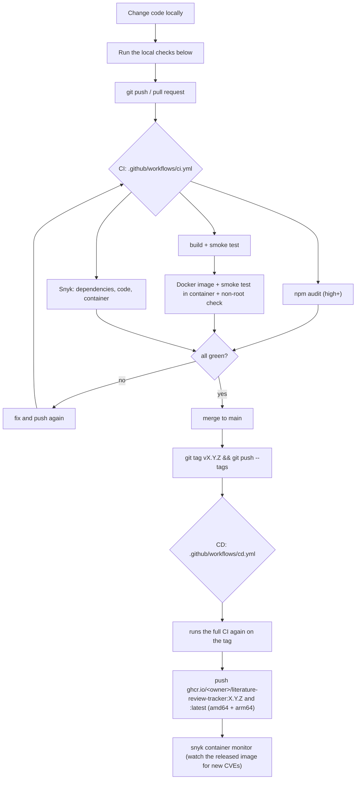

# CI/CD

How changes get checked and released. [CLAUDE.md](CLAUDE.md) requires reading this before starting a feature.



## CI: every push to `main` and every pull request

| Job | What it does | Why |
|-----|--------------|-----|
| `npm audit` | `npm audit --omit=dev --audit-level=high`, then the full tree at the same level | Known-vulnerable code that runs in production fails the build. Production means `dependencies`: server packages **and** libraries bundled into the browser (svelte, write-excel-file, html-to-image). Build-only tools (vite and its plugin) are `devDependencies` and never reach the image |
| `Build + smoke test + browser test` | `npm run build`, `npm test` ([scripts/smoke-test.mjs](scripts/smoke-test.mjs)), `npm run test:ui` ([scripts/ui-test.mjs](scripts/ui-test.mjs)) | The smoke test starts the real server on throwaway data and goes through the whole security flow over HTTP: forced 2FA setup, backup codes, TOTP replay rejection, forced password change, RBAC for all three roles, lockout and admin unlock, disable, 2FA reset, CSRF, sessions surviving a restart, the audit log, and data validation. The browser test drives the built UI in headless Chrome: the sign-in screens, every view, role-based tabs, and the Manage Data editors |
| `Docker image + smoke test` | Builds the image, starts it, runs the same smoke test against the container, checks it doesn't run as root and has no default test accounts | Catches Dockerfile breakage and anything that only differs in the production image |
| `Snyk` | `snyk test` (npm dependencies), `snyk code test` (static analysis of our source), `snyk container test` (base image OS packages + what's installed in the image), each failing on **high** or **critical**. Results go to the repo's *Security → Code scanning* tab. On `main` it also runs `snyk monitor` so Snyk keeps alerting on new CVEs | Dependency, code, and image vulnerabilities from one tool |

Workflows run on Node 24 (LTS), the same as the Docker image. Every third-party action is pinned to a full commit SHA, with the version tag in a comment, so a moved or compromised tag can't change what runs. Dependabot ([.github/dependabot.yml](.github/dependabot.yml)) opens weekly update PRs for npm packages, GitHub Actions (including the pinned SHAs), and the Docker base image. CI checks them like any other PR.

### Setting up Snyk (once per repository)

1. Sign in at [app.snyk.io](https://app.snyk.io) (free for open source) and copy your token from *Account settings → Auth Token*, or better, create a service account token for the organisation.
2. In GitHub: *Settings → Secrets and variables → Actions → New repository secret*, name **`SNYK_TOKEN`**.

Without the secret the Snyk job passes with a warning instead of scanning, so forks of this template still get green CI. **Once the secret exists, a high or critical finding fails the build.**

## Run the same checks locally before pushing

```bash
npm ci
npm audit --omit=dev --audit-level=high
npm audit --audit-level=high
npm run build && npm test                  # smoke test on a throwaway server
npm run test:ui                            # browser test (Chrome or Edge; BROWSER_PATH to choose)

snyk auth                                  # once; opens the browser
npm run security:scan                      # snyk test + snyk code test (high+)

docker build -t literature-review-tracker:local .
snyk container test literature-review-tracker:local --file=Dockerfile --severity-threshold=high
```

If a change touches sign-in, 2FA, roles, or the data API, add checks for it to `scripts/smoke-test.mjs`. That script is the regression suite.

## Scanner findings

`npm audit` (full tree, including build tooling) and `snyk test` both report **no known vulnerabilities**.

Fixed along the way:

- **Svelte 4 → 5 and Vite 5 → 8.** This removed the Svelte SSR/XSS advisories, the esbuild dev-server CORS issue, and Vite's dev-server path traversal and Windows `launch-editor` advisories. Components still use the Svelte 4 syntax, which Svelte 5 compiles in legacy mode.
- **`proxy-addr` 2.0.7 → 2.0.8** (critical, user impersonation through `X-Forwarded-For` parsing; comes in through express).
- **`xlsx` → `write-excel-file`.** SheetJS on npm is unmaintained and has high-severity prototype pollution and ReDoS advisories. See [src/lib/xlsx.js](src/lib/xlsx.js).

Snyk Code findings reviewed as false positives. They are medium or low severity, so they don't fail CI:

| Finding | Why it is a false positive |
|---------|----------------------------|
| "Allocation of resources without limits" on the PDF route and the SPA fallback (`server/index.js`) | Every request goes through `apiLimiter` (`app.use`, 600 per minute per IP) before these routes. Snyk only looks for a limiter on the route itself |
| "CSRF protection is disabled" | Session cookies are `SameSite=Lax`, the API only accepts JSON bodies, and `sameOrigin` rejects cross-site state-changing requests (the smoke test checks it). Snyk only recognises the `csurf` package |
| "Hardcoded passwords / credentials" in `scripts/` | Throwaway test accounts on a throwaway server that the tests create themselves |

Mark them *Ignored* in the Snyk web UI after checking that the reasoning still holds.

## CD: release a version

```bash
git checkout main && git pull
git tag v1.2.0 && git push origin v1.2.0
```

`cd.yml` runs the whole CI pipeline again on the tag. If it passes, it builds the image for `linux/amd64` and `linux/arm64`, then pushes `ghcr.io/<owner>/literature-review-tracker:1.2.0` and `:latest` using the built-in `GITHUB_TOKEN`, so no extra secret is needed. With `SNYK_TOKEN` set, Snyk then monitors that exact image.

Versioning follows [SemVer](https://semver.org): MAJOR for changes that need action from people running it (env vars, data format), MINOR for features, PATCH for fixes.

**Rollback:** every release keeps its own tag, so run the previous one, `image: ghcr.io/<owner>/literature-review-tracker:1.1.0` in compose, then `docker compose up -d`.

**Deploying:** the pipeline stops at publishing the image because every install runs somewhere different (a lab server, a VM, a NAS). To deploy automatically, add a job after `publish` in `cd.yml` that, for example, SSHes to your server and runs `docker compose pull && docker compose up -d`.

## Secrets used by the workflows

| Workflow | Needs | Notes |
|----------|-------|-------|
| `ci.yml` | `SNYK_TOKEN` (optional) | Smoke tests generate throwaway keys and passwords on each run |
| `cd.yml` | `SNYK_TOKEN` (optional), `GITHUB_TOKEN` (automatic) | `packages: write` is declared in the workflow |
